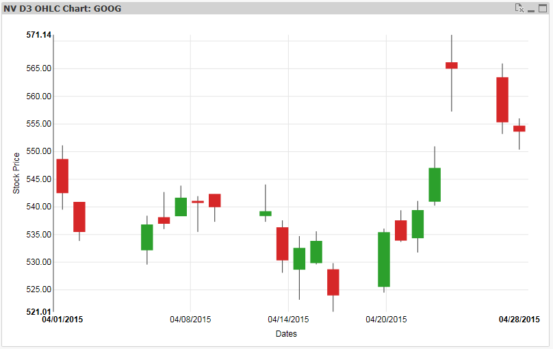
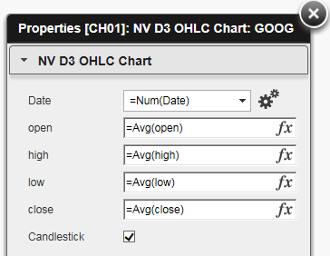

QlikView Extension NVD3OhlcChart
================================

This extension implements NVD3 OHCL and candlestick chart: https://nvd3-community.github.io/nvd3/examples/candlestickChart.html

Properties:
-----------

1. Date	: Dimension, date for timeline, a QlikView date as number needed: =Num(DateField)
2. open : Measure open stock price
3. high : Measure high stock price
4. low : Measure low stock price
5. close : Measure close stock price
6. Candlestick: switch chart type from OHCL to Candlestick
